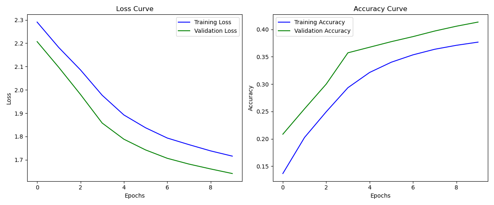

# 手写卷积神经网络实现

这是一个完全不依赖深度学习框架，仅使用 Python、NumPy 和 Numba 手动实现的卷积神经网络。

本项目从零构建了深度学习的所有核心组件，包括张量运算、层结构（卷积、池化、全连接）、激活函数、反向传播算法、优化器以及数据加载管线。项目针对 **CIFAR-10** 数据集进行了训练和测试。

## ✨ 核心特性

*   **纯手动实现**：所有的前向传播和反向传播梯度推导均由手动实现，深入理解计算图逻辑。
*   **Numba 加速**：利用 `@numba.njit` 对计算密集型的卷积层（`im2col` 风格循环）进行了 JIT 编译加速，显著提升了纯 Python 实现的训练效率。
*   **模块化设计**：完全解耦的架构设计，包含 `Layer`, `Activation`, `Optimizer`, `Loss` 等基类，易于扩展。
*   **完整训练管线**：包含数据预处理、BatchIterator、Exponential Scheduler及训练过程可视化。
*   **自定义上下文管理**：实现了类似 PyTorch 的 `no_grad` 上下文管理器，用于推理阶段禁用梯度计算。

## 📂 项目结构

```text
project_root/
├── data/                   # 数据存放目录
│   └── cifar10/
│       ├── train/          # 存放 data_batch_1.bin ~ data_batch_5.bin
│       └── test/           # 存放 test_batch.bin
├── model/                  # 模型保存及日志输出目录
├── src/                    # 核心代码库
│   ├── __init__.py
│   ├── activations.py      # 激活函数 (ReLU, Softmax)
│   ├── data_utils.py       # CIFAR-10 数据加载与预处理
│   ├── layer.py            # 网络层定义 (Conv, Pool, FC, Dropout, Flatten)
│   ├── loss_function.py    # 损失函数 (CrossEntropy)
│   ├── model.py            # 网络架构定义与模型管理
│   └── optimizer.py        # 优化器 (SGD, Scheduler)
├── train.py                # 训练脚本
├── test.py                 # 测试脚本
└── README.md
```

## 🛠️ 环境依赖

虽然不使用 DL 框架，但需要以下基础库进行数值计算和绘图：

*   **NumPy**
*   **Pandas**
*   **Numba**
*   **Matplotlib**

安装命令：

```bash
pip install numpy pandas numba matplotlib
```

## 🚀 快速开始

### 1. 准备数据
请下载 **CIFAR-10 binary version** 数据集，并解压至 `data/cifar10/` 目录。
确保目录结构如下：
*   `./data/cifar10/train/data_batch_1.bin` ... `data_batch_5.bin`
*   `./data/cifar10/test/test_batch.bin`

### 2. 训练模型
运行训练脚本。脚本会自动初始化网络，进行训练，并在 `model/` 目录下保存权重和训练曲线图。

```bash
python train.py
```

*   默认配置：Batch Size: 16, Epochs: 10, Optimizer: SGD
*   训练完成后，会生成 `training_history1.png` 展示 Loss 和 Accuracy 曲线。

### 3. 测试模型
加载训练好的模型权重及配置，在测试集上评估准确率。

```bash
python test.py
```

## 🧠 网络架构

本项目实现了一个经典的 CNN 结构，包含两个卷积块和一个全连接分类头：

1.  **Input**: (32, 32, 3)
2.  **Conv Block 1**:
    *   Conv2D (16 kernels, 3x3, stride=1)
    *   ReLU
    *   MaxPooling (2x2)
3.  **Conv Block 2**:
    *   Conv2D (32 kernels, 3x3, stride=1)
    *   ReLU
    *   MaxPooling (2x2)
4.  **Flatten**: 展平多维特征图
5.  **FC Block 1**:
    *   Fully Connected (Hidden Size: 128)
    *   ReLU
    *   Dropout (Training only)
6.  **Output Block**:
    *   Fully Connected (Output Class: 10)
    *   Softmax

## 🔧 技术细节实现

### 1. 卷积层加速 (Numba)
纯 Python 的多重循环卷积运算速度极慢。本项目在 `layer.py` 中使用了 Numba 的 JIT 编译技术：
```python
@numba.njit(cache=True)
def _conv_forward_numba(...):
    # 优化的四重循环实现
```
这使得模型可以在 CPU 上以可接受的速度进行训练。

### 2. 稳定的梯度计算
*   **参数初始化**：全连接层和卷积层均采用 **He Initialization (Kaiming Init)**，有效防止深层网络中的梯度消失或爆炸。
*   **数值稳定性**：Softmax 实现中减去了最大值以防止指数上溢；CrossEntropy 中对预测值进行了 `clip` 处理以防止 Log(0) 错误。

### 3. 反向传播 (Backpropagation)
所有层均实现了 `backward` 方法。
*   **Softmax + CrossEntropy**：推导了结合后的梯度 $\frac{\partial L}{\partial z} = y_{pred} - y_{true}$，极大简化了计算。
*   **Dropout**：采用 **Inverted Dropout**，在训练时进行缩放，使得测试时无需调整权重。

### 4. 优化策略
*   **SGD**：实现了标准的随机梯度下降。
*   **Exponential Scheduler**：实现了Step-based的指数学习率衰减，随着训练进行逐步降低学习率，帮助模型收敛到更优的极小值。

## 📊 结果示例

训练过程中的 Loss 和 Accuracy 变化将保存为图像：


